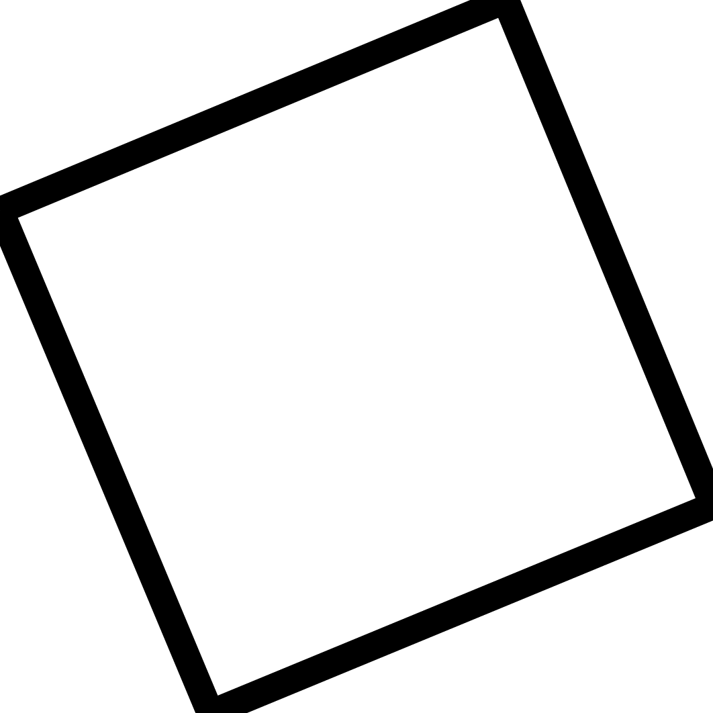
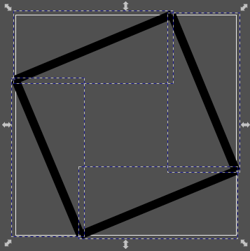
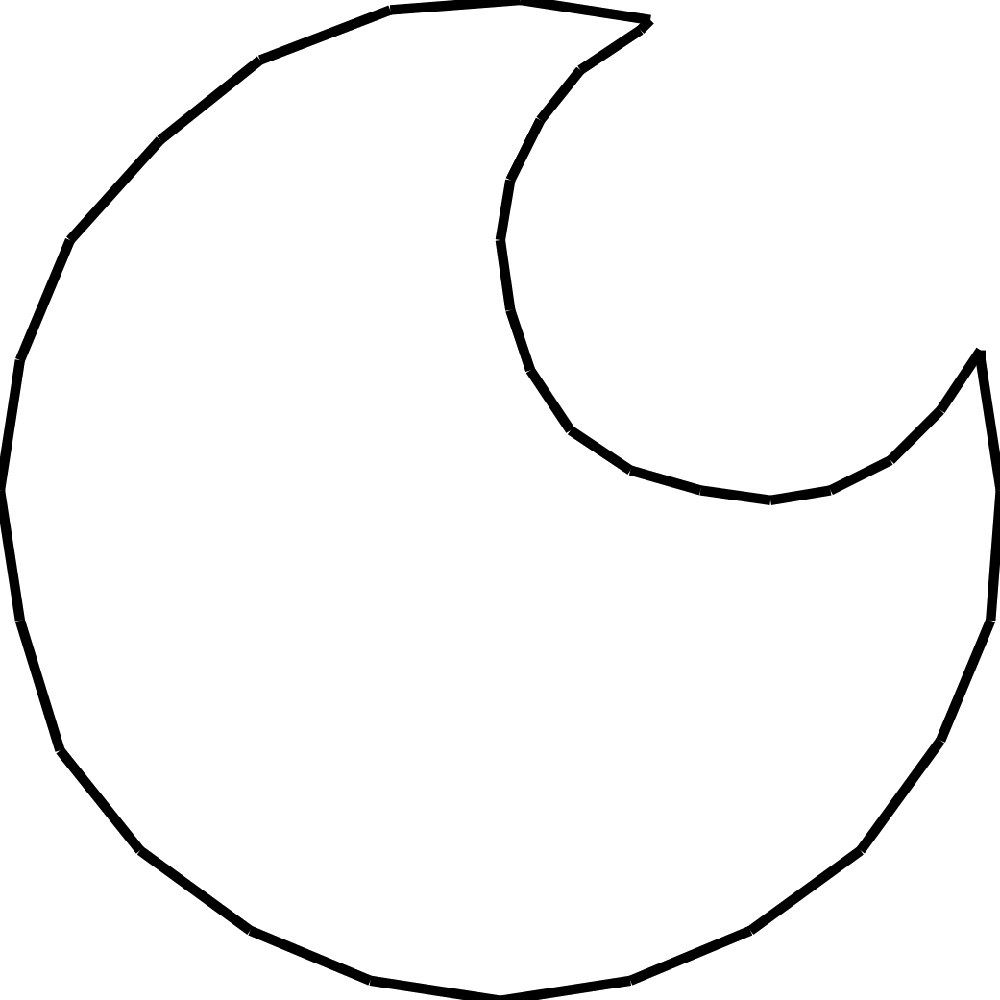
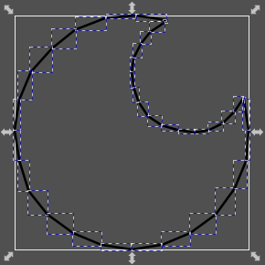
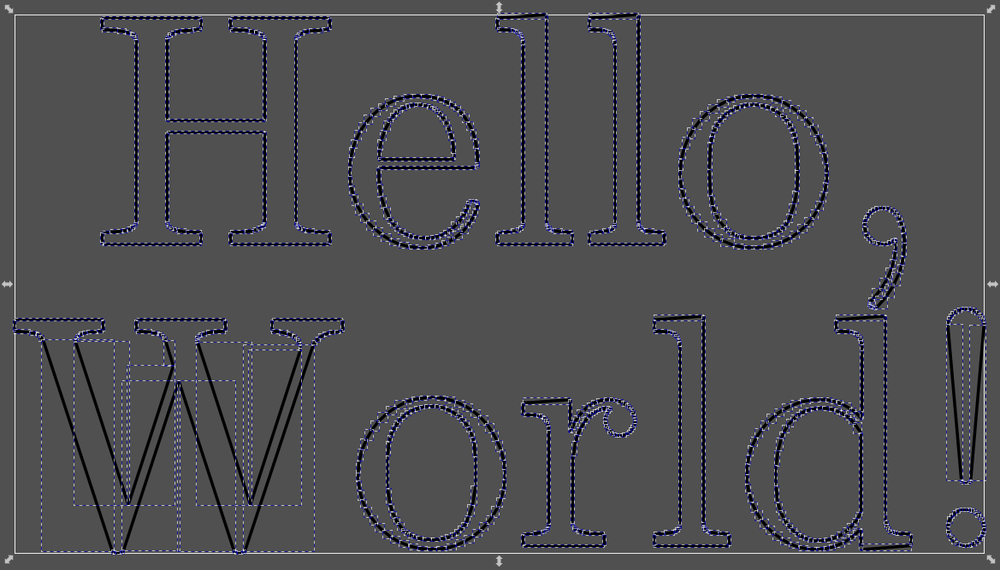
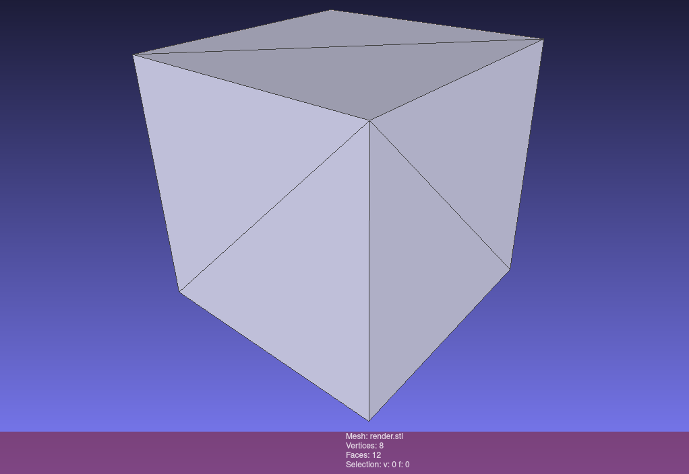

# SURREAL: SURface REconstruction ALgorithm

A new algorithm capable of extracting surfaces from Signed Distance Functions (SDFs). It supports:

- [X] Sharp corners/edges.
- [X] Automatic simplification of planar sections.
- [X] Multiple closed surfaces.

## Examples

See the [examples folder](examples).

### 2D

<table>
<tr>
<td>
Square (26µs, 4 lines)

</td>
<td>
Circles (1ms, 37 lines)

</td>
</tr>
</table>

Text (985ms, 17 surfaces, 814 lines)

### 3D

**The 3D version is broken for surfaces more complex than the example translated cube** (help wanted).

<table>
<tr>
<td>
Cube (621µs, 12 faces)

</td>
</tr>
</table>

## How does it work?

It uses 2 main parameters to control surface generation: the minimum angle to place a new vertex and the step size to
avoid missing small perturbations in the surface.

It works by starting on a random point (2D) or edge (3D) of the surface, choosing a direction and moving along the
surface (using a tangent) until the tangent at the new position is at an angle greater than minAngle. It then places a
new vertex, creating a line (2D) or triangle (3D) and adds to the processing queue the new point (2D) or edges (3D). The
queue is processed in a loop in the same way. It also detects when we reached the other end of the surface and properly
closes the surface, finishing the algorithm. To support multiple closed surfaces, a simple voxel sampler with gradient
descent to find the surface is used

This allows it to create a 4 line square in 12 microseconds and a 12 face cube in 120 microseconds.

